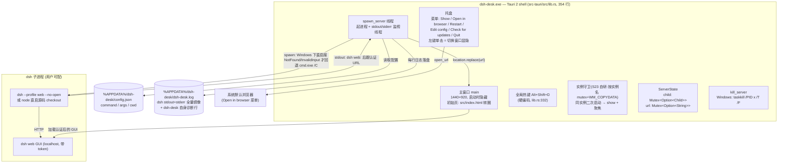
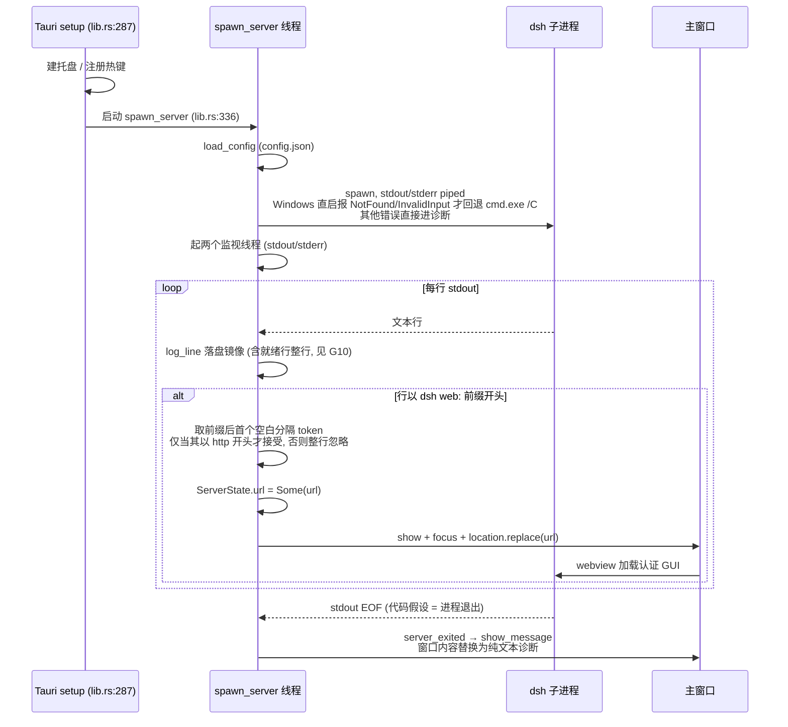
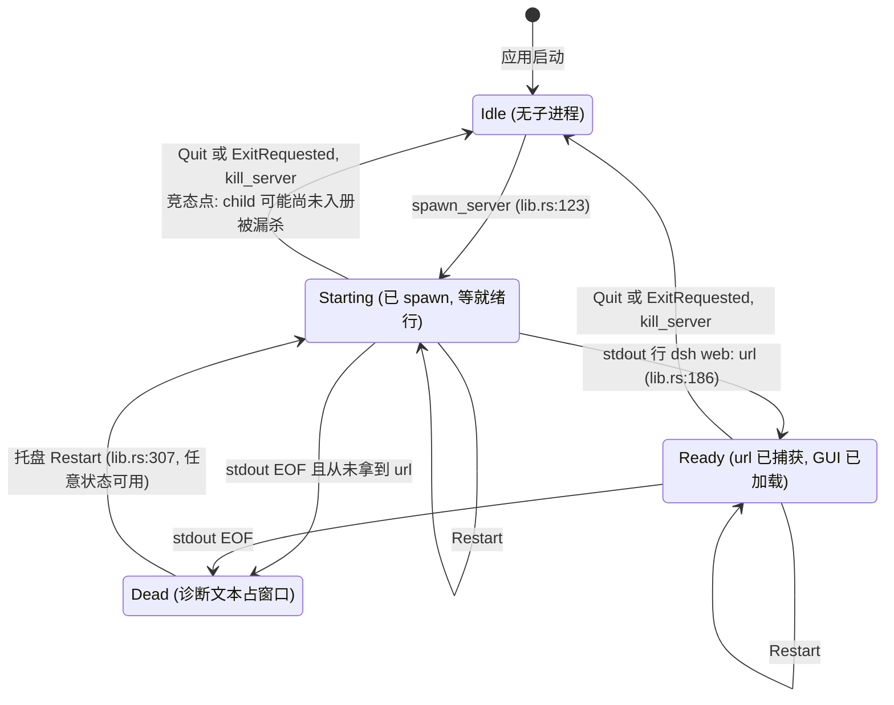
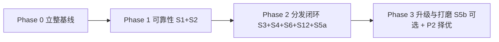
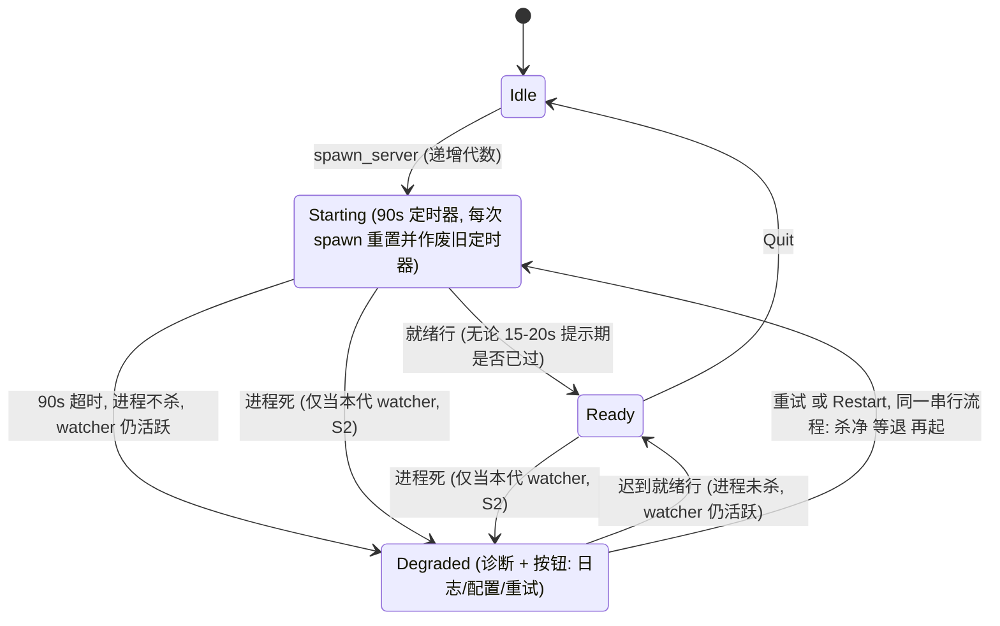

# dsh-desk 规范与计划(社区分发版)

> 状态:**v1.1**(2026-09-04,经双 subagent 评审修订)· 基线 commit `5e0c2af`(已推送 origin/main)
> 本文档只做规范与计划,**不含任何代码改动**。所有"现状"小节均标注代码出处,与代码一致。
> 注意:行号锚点是 `5e0c2af` 时点的快照指向,Phase 1 改动落地后自然过期,勿当活指针。

---

## 1. 现状架构(与代码一致)

### 1.1 组件关系图

### 1.2 启动时序图

### 1.3 服务生命周期状态机(现状)

图注:

- stdout EOF 在代码中被**假设**等价于进程退出(lib.rs:196);进程活着但关了 stdout 会被误报为死。
- Dead 的两条进入路径对应不同诊断文案(拿到过 URL 与否,lib.rs:210-224)。
- Restart 菜单分支无状态检查,任意状态可用;Quit/ExitRequested 从任意状态走 `kill_server`。
- **现状缺口**:`Starting` 的*自动*出边只有"就绪行"与"进程死"两条,无超时出边——dsh 改了就绪行文案,状态机永远停在 `Starting`,窗口无限转圈(G1)。Restart/Quit 是用户发起的出边,不构成兜底。

### 1.4 已知缺口清单(逐条锚定代码)

| # | 缺口 | 代码出处 | 对应规范 |
|---|------|----------|----------|
| G1 | 就绪行识别失败无超时降级,静默转圈 | lib.rs:181-199 + src/index.html | S1 |
| G2 | 生命周期竞态,两层:(a) spawn→child 入册(lib.rs:174)之间有窗口,此间 Quit/Restart 的 `kill_server` 扑空;(b) **旧 stdout 监视线程在 Restart 后读到 EOF,把新进程的 url/child `take()` 走**(`server_exited`,lib.rs:196-198, 210-217)→ 下次 Quit 扑空 → 孤儿 dsh/node 进程活过应用退出 | lib.rs:145-174, 196-217, 307-312 | S2 |
| G3 | 配置/日志路径只认 `APPDATA`,非 Windows 连 config.json 都不写 | lib.rs:41-51 | S11(defer) |
| G4 | 图标为 Tauri 默认模板,托盘不可辨识 | src-tauri/icons/ | S6 |
| G5 | 无 CI / 无预编译安装包,安装门槛 = Rust 工具链 | 仓库无 .github/ | S3 |
| G6 | 无更新感知,发出去的版本永远停在安装时点 | — | S5 |
| G7 | 首跑/失败信息只是窗口里的纯文本,无操作按钮 | lib.rs:227-238 show_message | S4 |
| G8 | 热键 Alt+Shift+D 硬编码 | lib.rs:332 | S8 |
| G9 | 窗口位置/大小不记忆 | tauri.conf.json | S9 |
| G10 | 就绪行**整行**(含认证 token)明文镜像进日志文件;而 S1/S4 的所有失败路径都在引导用户打开/粘贴该日志 | lib.rs:184-186, 56-69 | S1 |
| G11 | 发布物料缺失:README 只有源码安装章节;三个版本字段(Cargo.toml / package.json / tauri.conf.json)无唯一真源;WebView2 安装模式未决策(默认 downloadBootstrapper,装机需联网) | README.md, tauri.conf.json, Cargo.toml, package.json | S12 |
| G12 | WebView2 运行时"已安装但 Chromium < 119"无任何检测:页面 JS 静默崩溃(`AbortSignal.any`/`Promise.withResolvers` 不存在),用户只看到"连接异常"徽章,零升级指引。Evergreen 自动更新失效的机器真实发生过(pv 冻结 114,2026-09-04 事故,见 postmortem-2026-09-04-webview2-114.md) | 缺失检测,应在 lib.rs setup 窗口创建后、spawn 前新增 | S4 |

---

## 2. 产品规范(Spec)

### 2.1 定位

- **一句话**:把 `dsh web` GUI 变成一个"点图标即用"的桌面常驻应用,免终端、免复制 token。
- **用户**:dsh(DeepSeek Harness)社区用户,主力 Windows;会装软件,不一定会编译 Rust。
- **JTBD**:"我每次用 dsh 的 web 界面都要开终端、等 URL、复制带 token 的地址贴浏览器——我要像用普通桌面软件一样用它。"
- **成功标准(社区分发版)**:
  1. 安装 → 首次可用,零文档依赖(装完即用,不要求编辑 JSON 才能跑通主路径);
  2. 任何失败在 90 秒内可见且可操作(有下一步动作,不是死屏);
  3. **升级感知存在**:应用能提示新版本并指到 Releases 页(原地自动升级为 Phase 3 可选项,不作为成功门槛)。

### 2.2 Non-goals(明确不做)

- **不逆向/不依赖 DSH 内部实现**——只依赖"stdout 打印认证 URL"这一稳定 web 表面(README 已声明的架构赌注,保持)。
- **不做设置 GUI / 多 profile 管理**——设置 GUI 非目标不变。(2026-09-06 S23 注记:"单配置 JSON 足够"已被多实例超越——`--instance` 即按实例多配置 JSON,见 §2.3 S23;仍不做 GUI 管理界面)
- **暂缓 macOS/Linux**(G3)——除非社区出现真实呼声;届时路径层换 `app_config_dir()` 即可,不提前铺路。

### 2.3 改进项规范

#### S1 · 就绪感知与超时降级(P0,含日志脱敏)

- **问题**:G1(静默转圈)+ G10(token 明文落盘)。
- **方案**:
  1. **15-20 秒被动提示**:Starting 超过 15-20s 时,窗口在转圈旁显示"仍在启动…查看日志"的被动提示(不抢焦点、不进诊断态),慢启动不再是黑盒;
  2. **90 秒超时降级**:超时后窗口进入 Degraded 态:错误说明 + **打开日志**、**打开配置**、**重试** 三个动作按钮(替代现 `show_message` 纯文本,lib.rs:227-238)。**超时不杀进程**——dsh 可能只是起得慢,监视线程保持活跃,迟到就绪行仍可让窗口恢复(见 §3.1);
  3. **前缀匹配放宽**:从 `strip_prefix("dsh web: ")` 精确匹配(lib.rs:186)放宽为"按字面量 `dsh web:` 切分,取其后首个以 http 开头的空白分隔 token"——抗空格/措辞漂移,零误报成本;
  4. **日志脱敏**:镜像就绪行时只保留 scheme + host + port,token 部分掩码(lib.rs:184-186)。此为发布前置项,一旦带 token 的日志落到用户机器上就无法召回。
- **验收**:
  1. 改掉 dsh 输出前缀模拟漂移,≤90s 内出现含三按钮的可操作诊断;
  2. 20s 时窗口出现被动提示;
  3. 日志文件中就绪行不含 token(仅 scheme+host+port);
  4. 正常路径与 §2.4 契约一致。
- **涉及**:lib.rs(spawn_server/定时器/log_line)、src/index.html(提示态与诊断态骨架)、src-tauri/capabilities/default.json(按钮经 `#[tauri::command]` + invoke 调 Rust;opener 需文件路径 scope——Tauri 2 ACL 拒绝是常见的半天级卡点)。

#### S2 · 生命周期竞态收敛(P0,代数标记)

- **问题**:G2 两层竞态。真正的危险行为不是锁窗口本身,而是**旧监视线程的反噬**:Restart 后旧 stdout 线程读到 EOF → `server_exited` 把新进程的 url/child `take()` 走 → 窗口被错误覆盖、"Open in browser" 失效、下次 Quit 扑空留下孤儿进程。
- **方案**:
  1. **代数(generation)标记**:`ServerState` 增加单调递增计数(如 `AtomicU64`);每次 spawn 递增,本代 stdout 监视线程与 S1 定时器持有各自的代数;`server_exited` 与超时动作**仅在代数仍与当前一致时生效**,旧代线程读到 EOF 只安静退出;
  2. **spawn→入册原子化**:经同一把**短持有**的串行锁完成(不得跨 `spawn()` 持 child 字段锁——cmd.exe 回退可能很慢,而 `kill_server` 在托盘/主线程被同步调用,lib.rs:309,长持锁会卡 UI);
  3. **定时器同规则**:每次 spawn 启动新的 90s 定时器并作废旧代定时器(旧代超时不得对新代报障);
  4. **重试 = Restart**:Degraded 态的重试按钮走与托盘 Restart 完全相同的串行流程(杀净 → 等退 → 再起),禁止"旧进程还活着就直接 spawn"。
- **验收(可判定)**:记录 dsh/node 进程数基线 → 连点 Restart×10 → 末次后等 30s:进程数 == 基线,且 120s 内窗口回 Ready 或正确的诊断态 → **然后 Quit:无任何 dsh/node 残留进程**(末项是抓孤儿 bug 的关键,原"进程数不增长"测不出来)。
- **涉及**:lib.rs(ServerState/spawn_server/server_exited/restart 分支)。

#### S3 · CI 与预编译安装包(P1,社区分发主线)

- **问题**:G5。
- **方案**:GitHub Actions,`windows-latest`:push → bare `cargo check`(便宜,提前到 Phase 1 落地也可);tag/PR → 完整 `pnpm tauri build`,产出 NSIS/MSI 挂 GitHub Releases(控制 Windows 冷构建成本,不做每 push 全量构建)。updater 产物仅在 S5b 启用时追加。
- **验收**:打 tag 后 Release 页出现可安装的 `.exe`/`.msi`,新机器(无 Rust/Node、已装 dsh)装完可用默认配置跑通。
- **涉及**:新增 .github/workflows/(纯新增,不动现有代码逻辑)。

#### S4 · 首跑引导与失败可操作化(P1)

- **问题**:G7 + 首跑体验。
- **方案**:首跑(无 config.json)时探测 `where dsh`;找到 → 写默认配置照常起;找不到 → 窗口进入"安装引导态":说明 + **打开配置文件**按钮(编辑 command/cwd 指向源码 checkout 或自装路径)+ **重试**。引导态与 S1 的 Degraded 态复用同一套"窗口内动作按钮"机制(同一条 invoke/ACL 通路)。托盘菜单加 **Edit config** 项。
- **WebView2 版本检测(G12,2026-09-05 增补)**:启动时在 spawn 前读运行时版本(注册表 `HKLM\SOFTWARE\WOW6432Node\Microsoft\EdgeUpdate\Clients\{F3017226-FE2A-4295-8BDF-00C3A9A7E4C5}` 的 `pv`),已装但解析失败或 **< Chromium 119** → 进入"运行时过旧"引导态:显示当前版本/基线 + **打开运行时下载页**按钮(官方 bootstrapper fwlink 2124703)+ **重试**。完全未装运行时时窗口本身无法创建,不归本态管,由 S12 的安装期 bootstrapper 兜底。基线 119 与 `scripts/env-check.ps1` 保持一致。
- **验收**:干净机器(无 dsh)首跑 ≤10s 进入引导态且按钮可用;托盘 Edit config 能打开 config.json;注册表 pv 临时改低(测后恢复)时启动 ≤10s 进入"运行时过旧"引导态,下载按钮打开官方下载页,恢复 pv 后重试正常到达 Ready。
- **涉及**:lib.rs(load_config/spawn_server/托盘菜单/启动版本检测)、src/index.html、src-tauri/capabilities/default.json。

#### S5 · 更新能力(P1,两增量拆分)

- **问题**:G6。
- **方案**:
  - **S5a(Phase 2,默认路径)**:托盘 **Check for updates** → `GET /repos/{owner}/{repo}/releases?per_page=1` 取最新一条(2026-09-05 修订:原稿 `/releases/latest` 不含 prerelease,与下述"用 prerelease 测验收"自相矛盾;列表端点含 prerelease,draft 对未认证读取不可见)→ 与内置版本按 semver 比对(含 `-rc1` 预发布后缀;同号下纯发布 > 预发布)→ 有新版则打开 Releases 页(opener)。约 60 行,无签名密钥、无密钥管理负担,满足成功标准 #3;
  - **S5b(Phase 3,可选,门禁 Q2)**:tauri-plugin-updater 原地升级,签名公钥内置、私钥妥善保管。**明确失败模式:私钥丢失 = 已发布客户端(内置公钥)永远无法原地升级**,用户被晾在旧版——单人维护者若不愿承担密钥管理,永久停在 S5a 是完全正当的选择。
- **验收**:S5a——在真实仓库发一个更高版本号的 **prerelease**(draft 对 API 不可见,不能用 draft 测),旧安装能检出并打开 Releases 页。S5b——假版本升级走通且签名校验生效。
- **涉及**:lib.rs(托盘项 + 网络请求)、tauri.conf.json(S5b)、CI(S5b 产物)。

#### S6 · 品牌图标(P1)

- **问题**:G4。
- **方案**:出一套 dsh-desk 专属图标(ico/icns/png 全套),托盘/任务栏/安装包统一。
- **验收**:托盘与安装后开始菜单出现新图标;`pnpm tauri build` 无图标报错。
- **涉及**:src-tauri/icons/、tauri.conf.json。

#### S12 · 发布物料(P1,Phase 2 与 S3 同批)

- **问题**:G11——没有这些,"分发闭环"只对会编译的人闭环。
- **方案**:
  1. **README 增加 Install from release 节**:最低 Windows 版本(建议 Win10+);SmartScreen/杀软误报说明("仅从官方 Releases 下载");前置条件 = 已装 dsh;**Support 节** = GitHub Issues + 附 `%APPDATA%/dsh-desk/dsh-desk.log`(S1 脱敏落地后此文件才可安全外发);
  2. **版本真源**:tauri.conf.json 的 version 为唯一真源,tag 时 bump;Cargo.toml / package.json 的版本字段随真源同步(或 README 声明它们不追踪);
    3. **WebView2 决策(2026-09-05 勘误)**:选 `embedBootstrapper`(安装包 +约 1.8MB,README 注明)——原稿称其"离线可用"有误,官方语义为装机装运行时**仍需联网**,仅内嵌引导器本身;真离线只有 `offlineInstaller`(+约 127MB)可做到,未选(体积代价大,离线机器罕见)。离线/无运行时机器由 README 指引先手工装独立运行时包(fwlink 2124701),"已装但过旧"由 S4/G12 应用内门禁兜底;若社区出现真实离线装机需求,一行配置可翻为 offlineInstaller;
  4. **FAQ 预期差条目(2026-09-05 增补,用户实测提出)**:「浏览器打开 `http://127.0.0.1:<port>/` 显示 *dsh web authentication required*」不是故障——dsh 服务端要求**首次访问必须带 token**(`/?token=…` 换 30 天 cookie),裸 `/` 无凭证必 401。正确入口:桌面壳窗口(内部自动完成 token 交换,免手工);外部浏览器走**托盘 Open in browser**(带完整 URL 打开默认浏览器)。S1 脱敏后日志/终端不再出现带 token 的 URL,属故意设计(token 入日志=泄露),README 需向社区说明"从日志抄 URL"这条路已关闭。
- **验收**:一名非技术 Windows 用户**仅按 README** 从 Releases 完成安装并到达 Ready。
- **涉及**:README.md、tauri.conf.json(构建脚本的版本同步策略)。

#### P2 备选池(择优,不承诺)

| # | 项 | 一句话方案 | 触发条件 |
|---|----|-----------|---------|
| S7 | 托盘状态可视化 | server 意外退出弹系统通知;托盘图标反映 running/stopped。**已落地(2026-09-05,v0.2.1)**——验收口径:①仅"当时代数仍当前"的 watcher EOF 才弹 toast(Quit/Restart 的代数超越使其静默,复用 S2 语义);②托盘双色=ready/not-ready(彩色=已认领就绪行;灰=启动中/降级/引导态/已死——"stopped"措辞在慢启动降级态会说谎,故如此命名);③灰标由品牌图运行时合成(Rec.601 亮度 55%,不落第二份资产,规避 S6 图标缓存坑);④toast 失败必须落日志(Windows 下仅安装版可弹,静默失败不可接受);⑤§2.4 六条回归。同批落地(范围增补,记 §5):release 正文发布 SHA-256、README SmartScreen FAQ 含哈希校验 | Phase 3 有余量 → 已触发 |
| S8 | 热键可配置 | config.json 加 `hotkey` 字段,默认 Alt+Shift+D | 有用户报冲突 |
| S9 | 窗口状态记忆 | tauri-plugin-window-state | 几乎零成本,顺手 |
| S10 | 开机自启 | tauri-plugin-autostart,托盘开关 | 用户呼声 |
| S11 | 跨平台 | 路径层换 `app_config_dir()`,kill 走进程组 | 社区有 mac/linux 呼声 |
| S13 | 崩溃可诊断 | `std::panic::set_hook` → log_line;日志启动时写版本横幅与 dsh 命令行;启动时截断/轮转日志(现为无限增长) | Phase 3 |

#### UX 债务候选池(S14-S20,2026-09-05 UI/UX 评审产出,择优不承诺)

> 来源:2026-09-05 对壳层全部用户可见表面(等待页/三块引导面板/托盘/窗口行为/界面文案)的系统 UI/UX 评审。评审判定供参考:失败路径 UX 与状态可见性已达产品级(意外退出 toast、托盘双色、15s/90s 等待梯度、提示不抢焦点),债务集中在**反馈可见性、文案角色分离、视觉身份、可访性**四类。优先级(高/中/低)是评审判定不是排期承诺;与 P2 备选池同规则:择优、不承诺、不入 Phase 门禁。

| # | 优先级 | 项 | 方案要点 | 验收标准(可判定) | 触发条件 |
|---|---|---|---|---|---|
| S14 | 高 | 更新检查可见反馈 | Check for updates 三种结果(有新版/已是最新/网络失败)各有用户可见反馈,复用 S7 已落地的 notification 通道。**吸收 S5a 交付记录的已知缺口**(「无更新时无用户可见 UI(S7 范畴)」——S7 落地时未含此项,该备注自此作废) | 点击菜单后三种路径各有可见反馈且不静默(通知失败落日志);有新版行为不变(打开 Releases 页) | **已落地(2026-09-06)**;HTTP 预算 10s→4s;无新版实测 2.7s、重复 2.4s;网络失败分支未实机触发(netsh 无提权),送达级证据与边界见 [verification-2026-09-06-S14-S20.md](verification/verification-2026-09-06-S14-S20.md) |
| S15 | 高 | 面板/日志文案分离 | `show_degraded` 三条消息(spawn 失败/90s 超时/EOF 早退)一稿两用:`dsh-desk:` 日志前缀与 "readiness line" 内部术语直入面板。拆分:log_line 保留机器可 grep 前缀;面板文案按界面语汇重写(情境→原因→下一步,对齐已达标的 onboarding/runtime-old 两条的结构) | 面板渲染文本零 `dsh-desk:` 前缀、零 "readiness line" 措辞;日志行保持前缀(可 grep) | **已落地(2026-09-06)**,cargo test 锚定 + 真机 OCR 独立提取复验 |
| S16 | 中 | 可访性三件套 | src/index.html:①日志路径文本对比度 4.15:1(12px Consolas `#777`×`#fdf6e3`)→ ≥4.5:1;②按钮边框 `#b9b9b9` 对白底 ≈2:1 → ≥3:1(WCAG 1.4.11);③spinner 增加 `prefers-reduced-motion` 降级。**硬约束:不得引入 outline:none**——现有原生焦点环是键盘可达性承重墙,只许增强不许移除 | 三条逐项判定通过;键盘 Tab 走查焦点环仍可见 | **已落地(2026-09-06)**;数值经独立审查复算(.path 6.20:1/边框 3.45:1),键盘以 Tab+Enter 实点面板按钮实证 |
| S17 | 中 | 面板视觉身份 | 品牌资产已存在(design/app-icon.svg:主色 `#4D6BFE`、渐变 `#5B7AFE→#4D6BFE` 仅限品牌标记、Segoe UI Bold 字形)但窗口内表面零呼应。system-ui 在 Windows 即 Segoe UI,字体连续性暗中已成立,只补色/标/刻度:面板头部小尺寸品牌标记+状态词(唯一允许"响"的元素)、spinner/焦点环/主按钮用主色、圆角 8/6、间距 4/8/12/16/24、字号 13/14/16/20;`prefers-color-scheme: dark` 下不闪白。**硬约束:runtime-old 面板必须仍能在旧运行时渲染**(index.html 头注释的自举约束),不引入现代 JS API | 四个面板态(等待/degraded/onboarding/runtime-old)有品牌标记与主色;暗色偏好无白闪;pv 压低到 114 模拟环境(注册表法,同 S4 验收)面板渲染不崩 | **已落地(2026-09-06,含架构补强)**:实测本机 WebView2 把 prefers-color-scheme 钉死为 light(暗色系统仍亮),改为 Rust 读 AppsUseLightValue 真值注入 data-theme 双通道;暗/亮双分支真机像素实证;**pv=114 模拟渲染未测**(CSS 特性版本清单经审查复核,全 <114),留待后续;记录同上 |
| S18 | 中 | 引导态 Use detected dsh(**2026-09-06 按用户指定改为原始版方案**;原"checkout 填表"方案留池中) | 评审初判"PATH 检测未兑换成体验"经代码核实**仅部分成立**:dsh 在 PATH 时首跑已自动写默认配置直起(load_config 首跑落盘默认),装完 dsh 点 Retry 亦全自动;真实摩擦场景=config 的 command 为失效裸名而 dsh 已在 PATH(手编错、换机、后装)。实现:onboarding 面板检测 `where dsh` 命中时显示 "Use detected dsh" 首位按钮 → 写默认 config → 自动 Retry;guard 复查+失败面板可见提示。**已知边界**:checkout 用户多落在 degraded 面板,无此按钮——checkout 填表方案仍留本池 | 按钮显隐 OCR 双侧实证;一键闭环(重写 config→spawn→就绪行捕获)真机全过;§2.4 六条复验 | **已落地(2026-09-06)** |
| S19 | 低 | 首次进托盘告知 | 首次关窗藏托盘弹一次"仍在后台运行"通知(Discord/Steam 惯例);一次性状态位落点(独立标记文件 vs config 字段)实现时定,**勿污染用户可编辑的 config.json 语义** | 全新安装首次关窗弹一次且仅一次;后续关窗/二次安装零打扰 | **已落地(2026-09-06)**;exactly-once 以 Action Center 入库时间戳真机实证(首关 tick、二关静默);标记=独立文件 tray-hint.shown;显示层被本机 FA 抑制,证据为送达级(见验证记录) |
| S20 | 低 | 界面语言决策显式化 | 现状全英文文案是隐式决定,显式化为二选一:①英文-only = 正式决策(受众为全球开发者,上游官方语言 en)记 §5;②留 i18n 钩子(文案集中一处)。**决策留给用户拍板**(同 Q1/Q2/Q4 规则),agent 不代决 | 决策行落 §5 且 README/SKILL 措辞一致 | **已闭环(2026-09-06)**:决策=英文-only(见 §5),README Notes 补注 |
| S21 | 中 | 窗口 caption 断缝(左上角"切痕") | 原生 caption(纯白)与 GUI 侧栏(#F9FAFB,2026-09-06 像素实测)无共享水平线,接缝仅在侧栏列可见,读作"左上角被切"。双轨:**A(兜底)** DWM caption 配色——浅色 caption 染 #F9FAFB(COLORREF 0x00FBFAF9),暗色走 DWMWA_USE_IMMERSIVE_DARK_MODE(20);逐 HRESULT 落日志;CAPTION_COLOR(35) 是 Win11 22000+,Win10 浅色微缝维持现状(已知边界);**B(主路)** 无边框自绘标题栏——wry 0.55 已无条件开 WebView2 IsNonClientRegionSupportEnabled(Settings9,Runtime 123+,wry ≥0.40 起;特性仅提供 app-region 拖拽区命中,不画按钮——按钮绘制属另一仍在 prerelease 的 WCO API,故按钮自绘),setup 经 with_webview 探测 Settings9 cast:成功 → set_decorations(false),自家页内建 32px `app-region: drag` 条(带最小/最大化/关闭按钮,关闭=hide_to_tray 与原生 X 同契约);上游 GUI 页经 on_page_load 注入**仅一条透明 drag div**(幂等 + 'starting' 守卫;红线狭义豁免见 §5);探测失败 → 保持原生 caption,A 兜底,**永不出现无标题栏可用的窗口**。**硬约束:上游页除该 div 外零触碰;'starting' 守卫结构不变;无边框切换只发生在窗口可见前** | 探测成功:GetWindowLongW 无 WS_CAPTION 且 GUI 侧栏自 y=0 起(像素扫描 y≈2 与 y≈40 同色);drag/双击最大化/贴边分屏可用;自家页按钮三键工作(关闭=藏托盘);§2.4 六条复验。探测失败分支:模拟困难,记录为未实机触发+同构论证 | **已落地(2026-09-21,v0.3.1)**:真机验证抓到并修复 **P0 setup 内 with_webview 同步自死锁**(v0.3.0 首启必挂——探测挪旁路线程修复)+关闭钮 CSS 缺 right:0;修复后全项过(像素直证无白带、app-region 拖拽/双击最大化/系统菜单、自家页三键、热键/弹回抽查),见 [verification-2026-09-21-S21.md](verification/verification-2026-09-21-S21.md)。**验收判据偏差一处**:tao 0.35.3 的 set_decorations(false) 不摘 WS_CAPTION 样式位(to_window_styles 无条件加),以行为级证据取代样式位判据(原生 caption 不渲染+非客户语义全活+resize 边在)。贴边分屏未单项实测(拖至屏幕边缘的 snap 语义依赖同源 hit-test,引用拖拽通过项同构论证) |
| S22 | 中 | 子进程控制台窗口抑制 | release(GUI 子系统)下 spawn 控制台程序必弹窗:持续的 node 服务端窗口(用户实测,2026-09-06,且是 **token URL 唯一上屏出口**——S1 脱敏管不到)+ where/reg/taskkill 闪窗;debug 继承控制台故不可见。修复 = `hide_console()`(CREATE_NO_WINDOW,纯 std)落全部 5 处 spawn 点(notepad 故意可见,不动) | 同机对照:HEAD 构建有控制台窗命中、修复构建 0 命中;杀树零残留;`cargo test` 全绿 | **已落地(2026-09-06)**:探针对照 pre-fix 43 命中(where.exe 闪窗+持续 node 窗)/post-fix 0 命中,见 [verification-2026-09-06-S22.md](verification/verification-2026-09-06-S22.md);§2.4 全量走查并入 S23 战役 |
| S23 | 高 | 多实例支持(--instance) | **多进程模型,一实例一服务**(用户拍板 2026-09-06):`dsh-desk --instance <name>` 起独立进程,各自窗口/托盘/config/日志/dsh 服务;默认(无参)实例路径与行为**零变化**。关键事实(vendored 源码实证):single-instance 插件 2.4.4 锁名只认 app identifier、与 CLI 参数无关 → **弃用插件,自研按实例名分锁**(mutex+隐藏消息窗+WM_COPYDATA,复刻插件机制);window-state 2.4.1 `with_filename` 按实例分文件;**WebView2 数据目录必须按实例分**(两实例同在 127.0.0.1,cookie 不分端口,共享 cookie 库会互相覆盖认证 cookie——cf8f582 修的 401 同族)→ 窗口改代码创建经 `data_directory()` 指定,默认实例不指定(沿用 tauri 强制的原路径,零回归)。热键=**默认实例独占**(用户拍板),注册失败从"中止启动"降级为落日志(不改则命名实例起不来)。默认 config 首跑写入加 `--port 0`(多实例不撞 dsh 端口的必要条件,已存配置不动) | 双实例并起各自 Ready(窗口内容 OCR 金标准)、同实例重启唤醒/异实例互不干扰、Quit 按实例清点、先起实例后起实例后仍认证(cookie 隔离)、默认实例 §2.4 六条零回归、S22 回归(无控制台窗) | **已落地(2026-09-06,s22-s23 分支,Phase A+B 全过)**:Phase A(命名实例全语义)+Phase B(默认实例 §2.4 六条全量走查,v0.3.0 终版)真机全过;独立审查(1×P1 `default` 保留字/2×P2 超时投递+空句柄/6×P3)修复后重建复验;S22 的 Quit 路径 taskkill 闪窗断言在 Phase B 补上(60ms 观察器 0 命中),见 [verification-2026-09-06-S23.md](verification/verification-2026-09-06-S23.md) |

| S24 | 高 | 应用内签名自动更新器(S5b/Q2 兑现) | **分层设计**:HTTP 检查(GitHub list API,见 prerelease)=发现层;tauri-plugin-updater(latest.json+minisign 签名链)=安装层;安装层不可用/失败回退开 Releases 页(旧行为保留)。确认对话框(原生,不受 FA 抑制)→下载(签名校验先于执行)→`on_before_exit` 杀净 server(exit(0) 不走 RunEvent)+保存窗口几何→NSIS `/P /UPDATE /R` passive 安装→带参重启(`--instance` 存活)。**密钥(Q2)**:minisign 密钥对,公钥内嵌 tauri.conf.json,私钥/口令在 CI secrets+本地主拷贝(`~/.tauri/dsh-desk/`),**丢失即锁死全部已发布客户端**(spec §4 风险既录)。预发布永不自动装(GitHub latest 通道语义)。CI:tag 构建签名+latest.json;PR 构建(fork 无 secrets)关 updater artifacts | 本地端点全链路真机实测(检测→对话框→下载→验签→杀 server→安装→重启为新版本+server 复活就绪+零孤儿);"无更新"路径对真实 GitHub 实测;安装失败恢复路径同构论证 | **已落地(2026-09-21,v0.3.2)**:独立审查 3×P1(安装器启动失败僵尸态→exiting 复位+server 复活;fork PR 构建分支;README 矛盾)+1×P2(60s 超时)全修后复验;全记录见 [verification-2026-09-21-S24.md](verification/verification-2026-09-21-S24.md);CI 产物 latest.json 以 v0.3.2 Release 资产核验 |

### 2.4 正常路径回归契约(替代含糊的"零回归")

以下为每次交付前必须人工走查的**可观察契约**(也是 Phase 0 冒烟的记录模板):

1. 就绪行打印后,窗口显示并导航到认证 GUI(无 token 手工介入);
2. 托盘菜单全部可用:Show(切换显隐)/ Open in browser(打开认证页)/ Restart / Edit config(S4)/ Check for updates(S5a)/ Quit;
3. 热键 Alt+Shift+D 从任意应用切换窗口(S23 起:热键属默认实例;命名实例不注册);
4. **同一实例**二次启动唤起并聚焦该实例的窗口;**不同实例**(`--instance <name>`,S23 起)并存互不弹回;
5. 关窗 → 隐藏到托盘,server 继续运行;
6. Quit 后无 dsh/node 残留进程(本条在 S2 落地后对 Restart 后的场景同样成立;S23 起按实例清点——一个实例 Quit 不影响其他在场实例)。

---

## 3. 分阶段计划(Phase Plan)

| Phase | 目标 | 交付 | 验收门 | 依赖 |
|-------|------|------|--------|------|
| **0 · 立整基线**(半天) | 冻结基线,定义回归契约 | 处置未跟踪的 `ws-probe.cjs`(删或提交);提交 `docs/`(本文档);本机 `pnpm tauri build` + 真机启动冒烟一次,按 §2.4 记录基线;顺手落 push 触发的 bare `cargo check` CI | `git status` 干净;冒烟记录在案;CI 绿 | — |
| **1 · 可靠性**(1-2 天) | 失败全部可见、可操作、可脱敏 | S1(被动提示 + 超时降级 + 前缀放宽 + 日志脱敏)+ S2(代数标记 + 串行化重试);~~行动项:上游 issue 确认就绪行稳定性~~(原 Q3 已关闭——上游 issue 区禁用且明确不接受外部 PR,见 §5 2026-09-05 行) | S1/S2 验收标准逐条通过;§2.4 契约走查通过 | Phase 0 |
| **2 · 分发闭环**(2-3 天) | 社区用户装得上、首跑有人接、坏得起有日志 | S3 CI+安装包、S4 首跑引导、S6 图标、S12 发布物料、S5a 轻量更新检查 | 各项验收标准;干净 Windows 虚机**仅按 README** 装包到 Ready(含离线 WebView2 场景) | Phase 1(失败态/脱敏是引导态与外发日志的前提) |
| **3 · 升级与打磨**(按需) | 版本可演进(或明确不演进) | S5b 原地自动更新(门禁 Q2,可选)+ P2 择优(S9/S13 最可能) | S5b 验收(若启用);§2.4 契约 | Phase 2;Q2 决策 |

### 3.1 Phase 1 后的目标状态机(计划态,与 §1.3 对照)

图注:三条 S2 语义在此固化——(1) 旧代 watcher 的 EOF 不触发任何转换;(2) 重试与 Restart 是同一条串行路径,不允许"未杀先起";(3) 超时与 EOF 转换都只认本代。

---

## 4. Canonical Context Blueprint (English, agent-handoff ready)

> **快照说明(2026-09-06)**:本节是 Phase 0-3 立项时代的 handoff 快照,不逐批维护;S7 之后的交付事实以 §2.3 各行与 §5 决策/交付记录为准。

- **Objective**: Make dsh-desk distributable to the dsh community as a reliable, installer-based desktop shell for the dsh web GUI.
- **Product Intent**: One-click authenticated access to the dsh web GUI as a tray-resident desktop app; failures are always visible and actionable within 90s; logs are safe to share (token-redacted).
- **Scope**: S1 readiness hint + timeout degradation + prefix-tolerance + token redaction; S2 generation-tagged lifecycle (watchers/timers act only on their own generation; serialized kill→wait→spawn for Restart AND Retry); S3 CI (cargo check on push, full build on tag/PR) + prebuilt installers; S4 first-run guidance + actionable error states + tray "Edit config"; S6 branded icons; S12 release pack (README install/support, versioning single-source, WebView2 embedBootstrapper); S5a lightweight update check (Phase 2), S5b in-place updater optional (Phase 3, gated on key-management decision).
- **Non-goals**: No DSH-internal API integration (the `dsh web:` stdout line is the only contract); no settings GUI / multi-profile management; macOS/Linux deferred; S5b not required for success.
- **Constraints**: Tauri 2 + Rust only for shell logic; config stays a plain JSON file (`%APPDATA%/dsh-desk/config.json`); process-tree kill must keep Windows `taskkill /T /F` semantics; no breaking change to the §2.4 observable contract; do not hold the child lock across `spawn()` (UI jank via synchronous tray-thread kill_server).
- **Existing Repo Context** (inspected at `5e0c2af`, pushed): two commits (`101b492` initial shell; `5e0c2af` "Fix double-appended args; log to file; direct-exe spawn with cmd fallback"); tracked tree clean; untracked: `docs/` (this spec) and `ws-probe.cjs` (scratch probe, to resolve in Phase 0). `src-tauri/src/lib.rs` is 354 lines (server lifecycle, tray, hotkey, single instance). Also inspected: main.rs, tauri.conf.json (window 1440×920 hidden start, CSP null, targets all), capabilities/default.json (core/opener/global-shortcut defaults), src/index.html (spinner), package.json, README. Line anchors are snapshot pointers at this commit.
- **Required Deliverables**: Phase 0 — resolve ws-probe.cjs, commit docs/, build+launch smoke per §2.4, push-CI cargo check; Phase 1 — S1+S2 code changes + upstream stability issue filed; Phase 2 — .github/workflows, first tagged release, onboarding UI states, icon set, README release/support sections, versioning policy, WebView2 decision, S5a; Phase 3 — optional S5b, P2 picks.
- **Acceptance Criteria**: per-item in §2.3; global: §2.4 contract intact; every failure mode visible and actionable ≤90s; logs contain no auth tokens; rapid-Restart×10 then Quit leaves zero dsh/node processes; clean Windows VM reaches Ready following only README.
- **Risks**: dsh may change the readiness-line wording (mitigated: visible degradation + tolerant split match — both landed and verified in S1; upstream confirmation unobtainable: issue tracker disabled, external PRs declined, feedback routed to Discussions only, see decision log 2026-09-05); auth token in mirrored logs (mitigated by S1 redaction BEFORE any release artifact ships); unsigned installers → SmartScreen/AV friction (Q1); S5b signing-key loss strands old clients on their built-in pubkey (explicitly accepted if S5b skipped); WebView2 offline install; CI Windows cold-build time; docs line anchors rot after Phase 1 edits.
- **Open Questions**: Q1 code signing (pay for cert vs. accept SmartScreen warning for a community tool); Q2 who holds the S5b updater private key, with the stranding failure mode stated; Q3 upstream readiness-line stability (CLOSED 2026-09-05: upstream disables its issue tracker, explicitly declines external PRs, and self-describes as developer preview — no stability commitment is obtainable; risk accepted, mitigation = S1 tolerant match + visible degradation, S12 README to document the bet); Q4 distribution beyond GitHub Releases (winget?).
- **Verification Plan**: manual failure-injection (rename readiness prefix) for S1; rapid-restart-then-Quit process census for S2; clean-VM README-only install smoke for S3/S4/S12; prerelease-based update-check test for S5a (drafts are API-invisible); §2.4 walkthrough as the universal regression gate.

---

## 5. 决策记录(Assumption / Decision Log)

| 时间 | 决策 | 依据 |
|------|------|------|
| 2026-09-04 | 受众 = dsh 社区(非纯自用),分发升为主线 | 用户确认 |
| 2026-09-04 | 本轮只出规范与计划,不改代码 | 用户确认 |
| 2026-09-04 | 跨平台 defer,路径层重构不在本计划内 | 无 mac/linux 呼声,避免提前铺路 |
| 2026-09-04 | 保持"只依赖 stdout 认证 URL"契约,不逆向 DSH 内部 | README 声明的架构赌注;社区分发后升级频繁,解耦是生存条件 |
| 2026-09-04 v1.1 | S2 重定义为**代数标记**方案:根因是旧 stdout 监视线程反噬新状态(而非仅 spawn/kill 锁窗口),验收补"Restart 后 Quit 无残留进程" | subagent 评审 B1 |
| 2026-09-04 v1.1 | §3.1 补 Degraded→Ready(迟到就绪行)、重试=串行杀净再起、定时器随 spawn 重置 | subagent 评审 B2 |
| 2026-09-04 v1.1 | S1 增补:15-20s 被动提示、前缀匹配放宽、**就绪行日志脱敏**(发布前置) | subagent 评审 M2/m2 |
| 2026-09-04 v1.1 | 新增 S12 发布物料;CI 改为 push=check、tag/PR=全量;"零回归"替换为 §2.4 可观察契约 | subagent 评审 M3/m6/n4 |
| 2026-09-04 v1.1 | S5 拆两增量:默认走 S5a 轻量检查,S5b 原地升级可选(密钥丢失=老用户搁浅) | subagent 评审 M4 |
| 2026-09-04 v1.1 | 基线重锚 `5e0c2af`;Phase 0 改为处置 ws-probe.cjs + 提交 docs/ + 冒烟;Q3 转为 Phase 1 行动项 | subagent 评审 M1/n2/n3 |
| 2026-09-05 | **S1 已落地**(代码 + 真机自验 + §2.4 六条走查全过),自验记录见 [verification-2026-09-05-S1.md](verification/verification-2026-09-05-S1.md);范围/验收未变更,S2 未动,本文行号锚点自此过期 | 交付事实记录 |
| 2026-09-05 | **S6 已落地**(cursor-agent 三轮设计定稿"字体轮廓"方案;ico/icns/png 全套重生成;`pnpm tauri build` 无图标报错 + exe 内嵌图标抽取目验通过),记录见 [verification-2026-09-05-S6.md](verification/verification-2026-09-05-S6.md);真机托盘实时目视与开始菜单目视(依赖 S3 安装包)留待后续真机验证 | 交付事实记录 |
| 2026-09-05 | 吸收 IoT 后端经验(总纲"每个异常要么被拦住要么变成规矩"):新增回合末独立审查(skill 工作协议)、`.githooks/pre-commit` fmt 快检(fail-open,cargo check 归 S3 CI)、`scripts/env-check.ps1` 环境自检;受影响测试映射/天周级全量梯度**不采纳**(单 lib.rs 规模,规则成本>事故损失)。四级梯度落位见仓库 AGENTS.md"异常的下落"节 | 用户提供经验文章 |
| 2026-09-05 | S12 物料增补 FAQ 条目:「浏览器裸 URL → 401」预期差(壳内自动认证 vs 外部浏览器须带 token 首访;S1 后日志无 token 属故意) | 用户实测提出,社区大概率复问 |
| 2026-09-05 | **S4 范围增补(G12)**:启动时检测 WebView2 运行时版本,已装但 < Chromium 119 → "运行时过旧"引导态(当前/基线版本 + 官方下载页按钮 + 重试)。依据:2026-09-04 真实事故——本机 pv 冻结 114,页面 JS 静默崩溃仅显示"连接异常",用户零指引;S12 bootstrapper 只兜"完全未装",S1 降级只兜"服务器失败",此处为规范空白。详见 [postmortem-2026-09-04-webview2-114.md](postmortem/postmortem-2026-09-04-webview2-114.md) | 事故复盘 + 用户确认补齐 |
| 2026-09-05 | **S4 已落地**(首跑引导态 / 托盘 Edit config / WebView2 版本门禁;`cargo test` 9 passed;验收三条 + §2.4 六条真机全过,记录见 [verification-2026-09-05-S4.md](verification/verification-2026-09-05-S4.md))。验收口径与 §2.3 正文的落地偏差(独立审查后修正,均记验证记录):①两道门禁(运行时/安装引导)放 **spawn_server 内部对每次 spawn 生效**(boot/Retry/托盘 Restart 全路径),非 §2.3 字面的"首跑(无 config.json)时探测"——非首跑且 dsh 仍缺时引导态比裸 spawn 错误更准确,且防托盘 Restart 绕过运行时门禁;②过旧态下载链接用 **fwlink 2124701**(x64 独立包)而非本表原文的 2124703——bootstrapper 对已装实例报 already installed(0x80040828),恰是本态目标机器(postmortem 实锤);③pv 压低验收经 **HKCU** 路径执行(HKLM 写入需 UAC,非提权 shell 被拒;同一代码路径,顺带验证 per-user 回退——注册表探测按 loader 优先级 per-user 先、首个应答者定夺) | 交付事实记录 + 独立审查 |
| 2026-09-05 | S4 引导文案决策:**给 dsh 项目页链接**(github.com/deepseek-ai/deepseek-harness,README 已引用的稳定表面),不写死安装命令——安装方式会漂移,与"只依赖稳定表面"的架构赌注一致 | 用户留给 S4 定的开放点,实现时拍板 |
| 2026-09-05 | **S2 已落地**(代数标记 + 串行化生命周期:spawn/主动 kill/已上报退出各 mint 一代,watcher/timer 只认本代,Restart 与 Retry 同走杀净→等退→再起;`cargo test` 10 passed 含 S2 四条)。回合末独立审查抓到 1×P1(claim_exit 的 child 交接不原子——旧 watcher 微秒窗口可 take 走 Child 无 taskkill 直接 drop,kill 扑空,"EOF≈退出"假设下进程树活过 Quit)已修:child take 移进认领临界区、kill 的 bump 同入 child 锁、EOF 后 try_wait 仍活补杀、已死只 reap 防 pid 复用误杀;4×P2 同批处置。真机验收(判定式逐条):Restart 风暴 10 次效果确认(重试合计 16 周期)→ 清点恒 1 子进程、17 次旧代 EOF 全部 `superseded generation` 静默、`exited` 误报 0(S1 已知边界 1 根治)、终态 Ready;**托盘 Quit 后 dsh/node 零残留**;§2.4 六条全过(并与并行 S4 会话在同合并构建上的独立走查互为交叉证据)。记录见 [verification-2026-09-05-S2.md](verification/verification-2026-09-05-S2.md)。注:S2 验收期间与 S4 会话共享真机/工作树交错(其验证记录有述),本轮所有证据采自 S1+S4+S2 合并构建 | 交付事实记录 + 独立审查 |
| 2026-09-05 | **Phase 0 完成**:`ws-probe.cjs` 脱敏参数化后提交(原硬编码 token 未进 git 历史);此前各会话交付但未提交的 S1/S2/S4/S6 全部产物分批入库,git status 干净;**release 构建首次冒烟** §2.4 六条契约全过(记录见 [verification-2026-09-05-phase0.md](verification/verification-2026-09-05-phase0.md),含托盘驱动配方 v3:浮层开着时 6002 直投为首选开菜单方式);push CI(bare cargo check,windows-latest)落地 | 交付事实记录 |
| 2026-09-05 | **Q3 关闭(不可执行 → 风险接受)**:实测上游 deepseek-harness 仓库 `has_issues=false`(issue 区整体禁用,页示 "Issue creation is restricted")、CONTRIBUTING.md 明言 "cannot accept external pull requests at the moment"、反馈唯一入口 = GitHub Discussions(自述小团队未必逐条回复),且 README 自述 developer preview、预期破坏性变更——"提 issue 拿就绪行稳定承诺"既不可执行、也大概率无答案。缓解即 S1 已落地并验证的宽容匹配 + 90s 可见降级;S12 落地时在 README 记录该架构赌注与措辞漂移的故障形态(→降级态可操作)。可选后续:Discussions 发帖询问(外发动作,需用户拍板,不阻塞 Phase 2) | 用户提出 + gh API/CONTRIBUTING 实测核实 |
| 2026-09-05 | **S3 已落地**:release.yml(tag/PR 全量构建;build=contents:read 产 artifact,release=仅 tag、contents:write 挂 softprops;concurrency+timeout)+ check.yml tags-ignore + check-versions.mjs 守卫前置。验收 1 过——tag v0.1.0 → [Release 页](https://github.com/whyiyhw/dsh-desk/releases/tag/v0.1.0)挂 NSIS(4.35MB)/MSI(5.59MB);验收 2 本机部分过(静默安装→10.8s READY+WS ESTABLISHED,§2.4 六条在安装版全过,S6 开始菜单/托盘图标目视补齐),**干净虚机门禁保持开放**。记录见 [verification-2026-09-05-S3.md](verification/verification-2026-09-05-S3.md) | 交付事实记录 |
| 2026-09-05 | **S12 已落地**:README 四节(Install from release/Support/FAQ 401+漂移/versioning)+ embedBootstrapper + 版本真源守卫。**勘误**:embedBootstrapper 官方语义为装机仍需联网(仅内嵌引导器,+~1.8MB),原稿"离线可用"有误,§2.3 已改;真离线=offlineInstaller(+~127MB)未选,离线机器走 README 直链 fwlink 2124701。虚机 README-only 门禁开放。记录见 [verification-2026-09-05-S12.md](verification/verification-2026-09-05-S12.md) | 交付事实记录 + 审查勘误 |
| 2026-09-05 | **S5a 已落地**:托盘 Check for updates → `GET /releases?per_page=1`(偏离原稿 `/releases/latest`,因后者不含 prerelease 与验收条款矛盾,§2.3 已修订)→ semver 全序比对(含 `-rc` 后缀)→ 新版打开 Releases 页;独立线程零锁+在途去抖;失败仅日志。真机验收负向+正向全过(v0.1.1 prerelease fixture 检出并打开其 release 页,Chrome 标题实锤;fixture 测后删)。已知缺口:无更新时无用户可见 UI(S7 范畴)。`cargo test` 12 passed。记录见 [verification-2026-09-05-S5a.md](verification/verification-2026-09-05-S5a.md) | 交付事实记录 |
| 2026-09-05 | **S9 已落地**(v0.2.0):tauri-plugin-window-state,flags=SIZE\|POSITION——VISIBLE 与 MAXIMIZED 刻意排除(独立审查 P1:MAXIMIZED 恢复经 Win32 SW_MAXIMIZE 会在启动期显示并激活隐藏窗口,破坏 §2.4 契约 1;最大化状态因此不记忆,插件 Moved 处理器不设最大化守卫致最大化会话后恢复位置=显示器原点,记为已知小瑕疵)。真机:几何持久化 + 最大化 Quit 后 hidden-start 回归(确定性判据=首次可见瞬间就绪行已在盘)全过。记录见 [verification-2026-09-05-S9.md](verification/verification-2026-09-05-S9.md) | 交付事实记录 + 独立审查 |
| 2026-09-05 | **S13 已落地**(v0.2.0):panic hook(与测试共用闭包)、启动横幅(版本+exe+**dsh 命令行**——覆盖运行时过旧门禁等不落"started"行的路径)、日志轮转 >512KiB→`.old` 一代。轮转放 **setup()** 而非 run() 顶部(审查 P2:single-instance 第二实例死在 builder 期,顶部轮转会腰斩运行中实例的活日志)。真机轮转×2、横幅×2、`cargo test` 14 passed。记录见 [verification-2026-09-05-S13.md](verification/verification-2026-09-05-S13.md) | 交付事实记录 + 独立审查 |
| 2026-09-05 | **Phase 3:S5b 维持跳过**(默认路径):Q2(更新私钥归属)仍开放,单人维护者不承担"私钥丢失=已发客户端永久搁浅"的密钥管理是 spec 明示的正当选择;S5a 已满足成功标准 #3。若用户未来拍板启用,需:生成密钥+tauri-plugin-updater+CI updater 产物+按 §2.3 S5b 验收。P2 池 S7(托盘气泡反馈)/S8/S10/S11 未选(触发条件未满足:无用户报冲突/无自启呼声/无 mac-linux 呼声) | 决策记录 |
| 2026-09-05 | **Phase 2 虚机门禁仍开放(有据)**:本机排查无可用虚机平台——Hyper-V 功能查询与 Get-VM 均需提权(非提权会话不可用,亦无已建 VM 证据)、无 VirtualBox(VBoxManage 不存在)、无 VMware(vmrun 不存在)、WSL 是 Linux 发行版不适用。干净 Windows 虚机"仅按 README 装包到 Ready"仍是用户资源依赖项,待虚机可用后执行 | 实测排查 |
| 2026-09-05 | **Phase 2 虚机门禁放弃执行(用户决策)**:自建 Hyper-V 虚机三条路线(离线 dism apply / 官方 setup.exe 自动应答 / 纯 WinPE+startnet)全部死于宿主层——任何 guest ≤90s 冻结或自关机(Worker 18508)、心跳从未连上、Docker Desktop VM 早自 09-01 报 VMbus 协议 0x10004;根因实锤 = **宿主 Hyper-V 组件库载荷停留 2020 版**(vmms/vmcompute .320、vmbus.sys RTM、vmbusroot.sys 缺失)而内核已 .6456,DISM/SFC 报健康、功能禁用重启用重展开同版旧载荷、宿主重启无效。根治 = 就地修复升级(60-90 分钟)或换机,超出门禁合理成本,用户拍板放弃。残余风险(干净机 README 路径无端到端实证)已知并接受,对冲 = S4 两条门禁真机验证 + 安装版 §2.4 六条全过 + CI 绿。完整证据链与沉淀见 [postmortem-2026-09-05-host-hyperv-broken.md](postmortem/postmortem-2026-09-05-host-hyperv-broken.md);测试资产(D:\tmp\vm-gate 脚本/ISO/安装包)保留备换机复用 | 用户决策 + 取证 |
| 2026-09-05 | **S7 已落地**(v0.2.1;用户在收尾咨询中点选 ②SmartScreen FAQ + ⑦S7,前 Phase 3 行的"P2 未选"自此作废):意外退出 toast(tauri-plugin-notification,仅当前代数 watcher 触发,失败落日志)+ 托盘 ready/not-ready 双色(灰标=品牌图运行时 Rec.601@55% 合成,无第二资产);验收口径见 §2.3 P2 表 S7 行,真机验收(安装版):running sat=17.5→kill 后 1.1、toast 逐字目验、Restart 后 ready+彩色回归、§2.4 六条全过、`cargo test` 15 passed。独立审查 0×P1、2×P2(toast 错误吞掉→改落日志;spec 缺记录→本行+§2.3 补齐)、1×P3("stopped"措辞在慢启动降级态说谎→改 not-ready)全修。同批范围增补:release 正文 SHA-256(softprops body+generate_release_notes 拼接,已实证实测)+ README SmartScreen FAQ(为何弹/Run anyway 安全依据/certutil 校验)。记录见 [verification-2026-09-05-S7.md](verification/verification-2026-09-05-S7.md) | 交付事实记录 + 用户点选 + 独立审查 |
| 2026-09-05 | **增补 UX 债务候选池 S14-S20(§2.3 新增小节)**:按 ui-ux-pro-max 方法论对壳层全部用户可见表面做系统 UI/UX 评审(旅程走查/文案审查/状态可见性盘点/可访性清单/视觉方向提案)。高优先两条:更新检查可见反馈(S14,吸收 S5a 交付行"无更新无可见 UI(S7 范畴)"的已知缺口——S7 落地未含,该备注自此作废)、面板/日志文案分离(S15,`dsh-desk:` 前缀与 readiness line 术语泄漏入面板);评审初判"首跑一键配置"经代码核实收窄为 S18(仅 checkout 用户有摩擦,且与 §2.2 非目标有张力,真实诉求再议)。池子择优不承诺、不入 Phase 门禁;S20(界面语言)为开放决策点,留用户拍板 | UI/UX 评审产出 + 用户确认入库 |
| 2026-09-06 | **S14-S19 已落地**(用户指定整批实现;`cargo test` 17 passed 含 S15 分离与 REG_DWORD 解析锚定;安装版真机验收 + 独立审查后修复重建复验,全记录见 [verification-2026-09-06-S14-S20.md](verification/verification-2026-09-06-S14-S20.md)):S14 三结果 toast(无新版 2.7s/网络失败分支未实机触发—netsh 无提权)、S15 文案分离(OCR 独立提取)、S16 可访性(独立审查复算)、S17 品牌标记+主色+暗色、S18 Use detected dsh(闭环实证)、S19 exactly-once(时间戳实证)。**范围变更两则**:①S18 按用户指定实现原始版(一键回默认)而非本表原"checkout 填表",可达边界已写入 §2.3 行,checkout 填表留池;②S17 暗色架构补强——实测本机 WebView2 把 prefers-color-scheme 钉死为 light,改 Rust 读注册表注入 data-theme 双通道(媒体查询保留)。审查修复:P1 本行+§2.3 同步、P2 theme stamp 三处逃逸路径(show/热键/二次启动)补 stamp、P2 use_detected_dsh 静默失败改面板可见提示、P2 README 菜单/Updates 段过时同步。§2.4 六条真机全过(Open in browser 引用 S7/S5a 前证)。**toast 显示层受本机 FA 抑制(NVIDIA Overlay 触发),S14/S19 证据为送达级**(Action Center 入库时间戳+无失败日志+S7 同通道当日目验) | 交付事实记录 + 独立审查 |
| 2026-09-06 | **界面语言 = 英文-only(正式决策,关闭 S20)**:受众为全球开发者、上游官方语言 en,无 i18n 钩子;真实多语言呼声出现再议(届时文案集中一处)。README Notes 已注明 | 用户授权二选一,agent 择"记录决策" |
| 2026-09-06 | **窗口 401 修复(用户验收 S14-S20 时实测暴露,批次外 P0)**:根因不是 09-05 记的"脏 cookie 库"——日志反代实证 dsh 的 SameSite=Strict 认证 cookie 在**跨站发起的导航链**(tauri.localhost→127.0.0.1 的 location.replace)上既不落盘也不回发,`/?token=` 的 303 落 `/` 无 cookie → 401;删 Cookies 后首启照样 401(旧结论作废,AGENTS 已改写)。修复:open_gui 改**同源跳板**(先 replace 到 origin,落定后从同站上下文 replace token URL;sessionStorage 按 token 单发防重;30×300ms 重试 eval 覆盖导航竞态),同端口 Restart/跨端口 Restart 两条路径都被覆盖。验证:反代抓包(cookie-sent NONE→修后链路成立)+**窗口内容 OCR 为金标准**(真实会话列表可见,非 401)——netstat ESTABLISHED 判据就此作废(401 流程的 keep-alive 同样 ESTABLISHED,S1 以来部分"契约 1 通过"实为假阳性,回溯性风险已知)。探针与修复复验记录见 [verification-2026-09-06-S14-S20.md](verification/verification-2026-09-06-S14-S20.md) 附录 | 用户实测 + 代理取证 |
| 2026-09-06 | **新增 S21(窗口 caption 断缝)并批准 A+B 双轨,含"上游 DOM 红线的狭义豁免"**:B 需向上游 GUI 页注入一条 32px `app-region: drag` 透明 div(幂等、'starting' 守卫、除该 div 外零触碰)作无边框拖拽区——AGENTS.md"不得碰上游 GUI 页面 DOM"红线自此豁免**仅此一种注入**,其余触碰仍禁止;旧运行时(Settings9 cast 失败)自动回退原生 caption + DWM 配色,不留无标题栏可用的窗口 | 用户拍板"A+B 一起上";断缝取证 = 像素扫描(y=0-26 #FFFFFF → y=27+ #F9FAFB,接缝仅横跨 349px 侧栏列) |
| 2026-09-06 | **S22 已落地(多实例批次第一件)**:用户实测安装版弹 node 控制台窗(该窗口同时是 token URL 唯一上屏出口)——GUI 子系统进程 spawn 控制台程序不带 CREATE_NO_WINDOW 的标准行为,debug 继承控制台所以只在安装版暴露。`hide_console()` helper 落 5 处 spawn 点(spawn 双路径/where/reg×2/taskkill),notepad 故意可见不动。对照验证:探针对(identifier 改名+热键非致命,与用户在跑安装版共存,补丁不进仓库)pre-fix 43 命中/post-fix 0 命中,杀树零残留。记录见 [verification-2026-09-06-S22.md](verification/verification-2026-09-06-S22.md)。**并行会话在主工作树做 S21(caption 断缝),本批(S22/S23)按 worktree 铁律在 `s22-s23` 分支进行** | 用户实测 + 交付事实记录 |
| 2026-09-06 | **S23 多实例立项决策(用户拍板)**:①产品形态 = **多进程,一实例一服务**(`--instance <name>`;单窗口多服务的标签页方案否决——UI/生命周期重做成本数倍);②热键 = **默认实例独占**(命名实例不注册;注册失败降级落日志,不再中止启动);③默认 config 首跑写入加 `--port 0`(多实例并存的必要条件,已存配置不动)。技术路线(agent 源码实证,非猜测):single-instance 插件锁名与参数无关故弃用自研;WebView2 数据目录按实例分(cookie 不分端口,共享则认证 cookie 互踩——401 修复同族风险);默认实例全部路径/行为零变化 | 用户二选一拍板 ×2 + 源码实证 |
| 2026-09-06 | **S23 已落地(s22-s23 分支,Phase A+B 全过)**:多实例 `--instance`(多进程一实例一服务)——自研按实例分锁守卫(mutex+隐藏窗+WM_COPYDATA,SendMessageTimeoutW 3s)替代 single-instance 插件;窗口改代码创建,命名实例独立 WebView2 剖面(LOCALAPPDATA,防 127.0.0.1 cookie 互踩);热键默认实例独占、注册失败降级;默认 config 首跑含 `--port 0`(`default` 为保留名)。Phase A 真机全过(共存/认证 OCR/cookie 隔离/弹回唤醒)+ 审查 1P1/2P2/6P3 全修后复验;Phase A+B(默认实例 §2.4 六条全量走查,含热键归属/弹回零副作用/Quit 零残留/Quit taskkill 闪窗)真机全过,合并门禁清空。记录见 [verification-2026-09-06-S23.md](verification/verification-2026-09-06-S23.md) | 交付事实记录 + 独立审查 |
| 2026-09-21 | **S21 真机验证补全(合并后首验)——抓到 P0 并修复,v0.3.0 就此定性为坏版**:v0.3.0 全新安装首启必挂在 setup(日志停 banner、主线程不泵消息)——根因是 S21 的 init_borderless_chrome 在 setup(主线程)里调 with_webview,而 tauri-runtime-wry 的 send_user_message 对主线程调用**同步就地执行闭包**,闭包内 WebView2 COM 调用又要事件循环泵消息 → 自死锁(tauri-runtime-wry-2.11.4 源码实证)。修复=探测挪 std::thread::spawn 旁路线程(同调用经 proxy 投递、在泵着的循环上执行,仍远早于就绪显窗)。同批:关闭钮 CSS 缺 right:0(absolute 无水平偏移会飘到左端)修复。**教训入 AGENTS:setup 里不许直接调 with_webview** | 真机验证 + vendored 源码取证 |
| 2026-09-21 | **S21 验收判据偏差记录(行为级取代样式位)**:tao 0.35.3 set_decorations(false) 返回 Ok 但不摘 WS_CAPTION(to_window_styles 无条件 `style \|= WS_CAPTION`,仅 CHILD/全屏例外)——实测无边框行为完全成立(原生 caption 不渲染、app-region 拖拽/双击最大化/右键系统菜单、wry TAURI_DRAG_RESIZE_BORDERS 供边缘 resize),"GetWindowLongW 无 WS_CAPTION"判据就此作废,以像素+行为证据为准。另:条带顶部 ~8 物理像素是 resize 带(wry 边框辅助窗顶边),点击测试/用户拖拽应避开,属正常边缘语义 | 真机像素/行为实测 |
| 2026-09-21 | **Q2 更新密钥拍板启用(用户:"拍板 Q2"),S5b 就此兑现为 S24**:minisign 密钥对生成(CI secrets ×2 + 本地主拷贝 `~/.tauri/dsh-desk/` 三件套,**待用户离线备份;丢失=锁死全部已发布客户端**);首对密钥因 MSYS openssl base64 口令带 `
` 无法解密作废重生成(Windows 口令生成避开 openssl CRLF);更新通道语义=**预发布永不自动安装**(latest.json 走 GitHub latest 通道,prerelease 不在其中),手动经 Releases 页 | 用户拍板 + 密钥仪式记录 |
| 2026-09-21 | **S24 已落地(v0.3.2)**:分层更新(HTTP 发现/updater 签名安装/开页回退)、on_before_exit 杀 server 兜住 exit(0) 旁路、窗口几何随更新保存、NSIS 带参重启(`--instance` 存活)。**排障沉淀**:被打断的构建留 0 字节 exe→cargo 指纹"输出比依赖新"跳过重链→NSIS 忠实打包 0 字节+signer 忠实签名+updater 忠实安装=全链假故障(教训入 AGENTS:中断构建后删产物重链,勿信指纹);坏安装器注册表 InstallLocation 劫持默认安装路径(显式 /D= + 清注册键复原)。独立审查 3×P1+1×P2 全修(僵尸态恢复/fork PR 分支/README/超时) | 真机验证 + 独立审查;记录 [verification-2026-09-21-S24.md](verification/verification-2026-09-21-S24.md) |
| 2026-09-21 | **Q1 代码签名显式暂缓(用户:"先不加吧")**:当前用户量下 SmartScreen FAQ+SHA-256 校验和够用;触发重议条件=真实用户反馈安装警告/杀软误报;届时首选 Azure Trusted Signing(~$10/月,个人可验),次选 Certum OV(€70-90/年)。**落地时的工程坑已预研**:Authenticence 改字节→必须先 Authenticode 后生成 minisign .sig,顺序反了更新器拒装自己发的包 | 用户拍板;Q2 已于同日兑现(见上),池中仅剩 Q1/Q4 |
| 待定 | Q1 代码签名 / Q2 更新密钥 / Q4 winget | 需用户决策,见 §4 |
